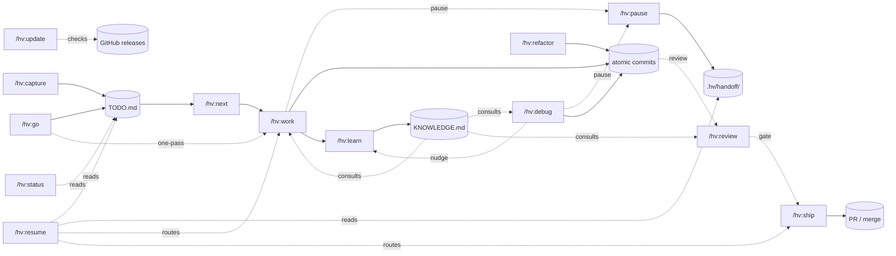

<div align="center">

# hv-skills

**A zero-dependency project backlog for Claude Code — capture, execute, review, ship.**

[](https://github.com/l4ci/hv-skills/releases)
[](LICENSE)
[](https://github.com/l4ci/hv-skills/commits)
[](https://github.com/l4ci/hv-skills/stargazers)
[](https://claude.com/claude-code)

[Quick start](#quick-start) · [Skills](#skills) · [How it works](#how-it-works) · [Full guide](GUIDE.md)

</div>

---

## Why hv-skills?

- **Your backlog lives with your code.** Per-project `.hv/` folder, gitignored. No external tool to open, no context-switch.
- **Zero dependencies.** Bash, Python 3, Git, and optionally `gh` — all already on a developer's machine. No npm, no pip, no daemon, no database, no cloud.
- **Your agent already knows the project.** Let Claude Code pick the next task, execute it in parallel, and commit per task — atomic history, easy reverts.
- **Knowledge persists across sessions.** Capture hard-won gotchas, conventions, and constraints into `.hv/KNOWLEDGE.md`; future work consults it automatically.
- **Zero ceremony.** One `/hv:capture` routes bugs, features, and tasks to the right section with auto-incrementing IDs.

## Features

|  |  |
|---|---|
| 📥 **Auto-classified capture** — bugs, features, tasks routed with priority/size tags and zero-padded IDs (`[B01]`, `[F01]`, `[T01]`) | ⚡ **Parallel execution** — orchestrator plans, workers implement in parallel, one atomic commit per task |
| 🌿 **Branch or worktree isolation** — main stays clean while agents work, run multiple sessions side by side | 🧠 **Knowledge retention** — `/hv:learn` distills durable learnings; `/hv:work`, `/hv:debug`, and `/hv:review` all consult them |
| ♻️ **Backlog reconciliation** — `/hv:next` validates `status.json` against git state, auto-cleans stale entries | 🐛 **Systematic debugging** — `/hv:debug` reproduces, hypothesizes, verifies, fixes, nudges `/hv:learn` |
| 🚢 **Review-gated shipping** — `/hv:ship` runs `/hv:review` against original intent + conventions before PR or merge | 💾 **Context-clear recovery** — `/hv:resume` re-reads active streams with recent commits and routes you back to work |
| 🔧 **Refactor cycles** — `/hv:refactor` explores friction, designs competing approaches, fixes in parallel | 🤝 **Graceful handoff** — `/hv:pause` writes what's in your head (hypothesis, next step, mid-edit files) so `/hv:resume` picks up after a `/clear` |

## Quick start

```bash
# Install the plugin
claude plugin marketplace add l4ci/hv-skills
claude plugin install hv-skills

# In your project
/hv:init                                     # one-time setup
/hv:capture "timer bug + keyboard shortcut"  # auto-classify and file
/hv:next                                     # review + pick + execute
```

First run takes ≤30s and creates `.hv/` with `TODO.md`, `KNOWLEDGE.md`, 19 CLI helpers, and a managed knowledge-index block in `CLAUDE.md`. `/hv:init` asks four questions (models, isolation, merge strategy, quality gates) with Recommended defaults highlighted; skip or accept to get the defaults.

## Skills

| Skill | Description |
|-------|-------------|
| `/hv:init` | Initialize `.hv/` with `TODO.md`, `KNOWLEDGE.md`, `counters.json`, `config.json`, `status.json`, and helpers |
| `/hv:capture` | Capture bugs, features, and tasks — auto-classifies, assigns priority/size, routes to the correct section |
| `/hv:c` | Shortcut for `/hv:capture` |
| `/hv:go` | Capture an item and immediately implement it — combines `/hv:capture` + `/hv:work` in one pass |
| `/hv:next` | Review backlog, reconcile active work against git state, suggest the next item, route to `/hv:work` |
| `/hv:status` | Compact read-only state glance — counts, active work, recent completions, knowledge topics |
| `/hv:resume` | Reorient after `/clear` — active streams with recent commits and any handoff notes, routes to `/hv:work`, `/hv:ship`, or `/hv:next` |
| `/hv:pause` | Gracefully stop mid-session — writes a handoff note (next step, hypothesis, mid-edit files) for the next session's `/hv:resume` |
| `/hv:work` | Orchestrated parallel implementation with per-task commits; consults `KNOWLEDGE.md` for relevant topics |
| `/hv:debug` | Systematic bug cycle — reproduce, hypothesize, verify, fix with one atomic commit, nudge `/hv:learn` |
| `/hv:review` | Staff-engineer review of a branch vs original intent + `KNOWLEDGE.md`; returns PASS / CONCERNS / FAIL |
| `/hv:ship` | Bundle commits into a PR (or direct merge) with ID-linked body; runs `/hv:review` first by default |
| `/hv:learn` | Extract durable session learnings into `KNOWLEDGE.md`, grouped by topic; Opus verification on by default |
| `/hv:refactor` | Full architectural refactor cycle with parallel design + implementation subagents |
| `/hv:update` | Check for a newer hv-skills release on GitHub and print the exact update command for your install type |

## How it works



Everything Claude reads or mutates lives under `.hv/` in your project. Git is the source of truth — `status.json` is just a cache, and `/hv:next` reconciles any drift.

## Configuration

Edit `.hv/config.json`:

```json
{
  "models":   { "orchestrator": "opus",   "worker": "sonnet" },
  "work":     { "isolation": "branch",    "mergeStrategy": "direct" },
  "refactor": { "confirmBeforeExecute": true },
  "learn":    { "verify": true },
  "ship":     { "review": true }
}
```

Defaults favor clean integration (branch isolation, direct merge, review gate on, knowledge verifier on). See [GUIDE.md § Configuration](GUIDE.md#configuration) for every key and when to flip it.

## Architecture

```
.hv/
├── TODO.md           # bugs, features, tasks, recent completions
├── KNOWLEDGE.md      # durable learnings, grouped by topic
├── ARCHIVE.md        # completions older than 5 days
├── counters.json     # auto-incrementing IDs
├── config.json       # models, isolation, merge, verify
├── status.json       # active work streams
├── bugs/ features/ tasks/   # overflow detail files
├── handoff/          # /hv:pause notes, one per branch; /hv:resume consumes them
└── bin/              # 19 CLI helpers (hv-next-id, hv-append, hv-complete,
                      #  hv-guard-clean, hv-status-add, hv-status-remove,
                      #  hv-archive-old, hv-knowledge-index, hv-knowledge-query,
                      #  hv-reconcile, hv-backlog, hv-merge, hv-pr,
                      #  hv-refactor-age, hv-summary, hv-ship-body,
                      #  hv-review-scope, hv-update-check, hv-preflight)
```

Helpers collapse multi-step agent logic into single subprocess calls — less context consumed per invocation, consistent output format.

## Install alternatives

### npx one-liner

```bash
npx @anthropic-ai/claude-code plugin marketplace add l4ci/hv-skills
npx @anthropic-ai/claude-code plugin install hv-skills
```

### Local development (GNU Stow)

```bash
git clone https://github.com/l4ci/hv-skills.git ~/Code/hv-skills
stow --dir="$HOME/Code" --target="$HOME/.agents/skills" hv-skills
# remove: stow --dir="$HOME/Code" --target="$HOME/.agents/skills" -D hv-skills
```

## Testing

Smoke-test the CLI helpers against a throwaway `.hv/` in a tmpdir:

```bash
bash test/smoke.sh
```

Exercises all 19 helpers across 38 assertions. Exits non-zero on any failure.

## Contributing

Issues and PRs welcome. Keep changes minimal, include a smoke-test assertion if you touch or add a helper, and follow the commit style in `git log`.

## License

[MIT](LICENSE)
