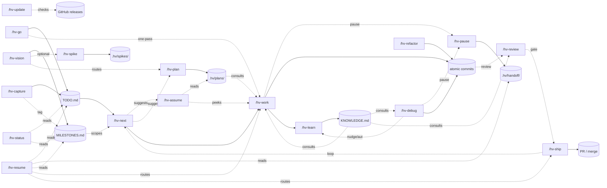

<div align="center">

# hv-skills

**Plan with intent, ship atomic commits, retain hard-won knowledge — a zero-dependency development workflow for Claude Code.**

[](https://github.com/l4ci/hv-skills/releases)
[](LICENSE)
[](https://github.com/l4ci/hv-skills/commits)
[](https://github.com/l4ci/hv-skills/stargazers)
[](https://claude.com/claude-code)

[Quick start](#quick-start) · [Skills](#skills) · [How it works](#how-it-works) · [Full guide](GUIDE.md)

</div>

---

## Why hv-skills?

- **Plan with intent, not just intuition.** `/hv-vision` for milestones, `/hv-plan` for sign-off plans, `/hv-spike` for feasibility experiments, `/hv-assume` for pre-execution approach peeks. The plan exists before the code does.
- **Ship atomic per-task commits.** Clean history, easy reverts; every commit lands one task with one verify step. Parallel workers, one orchestrator, no merge mess.
- **Knowledge that compounds.** `/hv-learn` distills hard-won gotchas and conventions into `KNOWLEDGE.md`; `/hv-work`, `/hv-debug`, and `/hv-review` all consult it automatically on future runs.
- **Your code, your `.hv/`, your machine.** No daemon, no MCP server, no cloud, no database. Bash + Python + Git + optionally `gh` — that's it.
- **Survives `/clear`.** `/hv-pause` writes a handoff note (current hypothesis, next step, mid-edit files); `/hv-resume` picks up where you left off, even in a fresh session.

## Features

|  |  |
|---|---|
| 📥 **Auto-classified capture** — bugs, features, tasks routed with priority/size tags and zero-padded IDs (`[B01]`, `[F01]`, `[T01]`) | ⚡ **Parallel execution** — orchestrator plans, workers implement in parallel, one atomic commit per task |
| 🌿 **Branch or worktree isolation** — main stays clean while agents work, run multiple sessions side by side | 🧠 **Knowledge retention** — `/hv-learn` distills durable learnings; `/hv-work`, `/hv-debug`, and `/hv-review` all consult them |
| ♻️ **Backlog reconciliation** — `/hv-next` validates `status.json` against git state, auto-cleans stale entries | 🐛 **Systematic debugging** — `/hv-debug` reproduces, hypothesizes, verifies, fixes, nudges `/hv-learn` |
| 🚢 **Review-gated shipping** — `/hv-ship` runs `/hv-review` against original intent + conventions before PR or merge | 💾 **Context-clear recovery** — `/hv-resume` re-reads active streams with recent commits and routes you back to work |
| 🔧 **Refactor cycles** — `/hv-refactor` explores friction, designs competing approaches, fixes in parallel | 🤝 **Graceful handoff** — `/hv-pause` writes what's in your head (hypothesis, next step, mid-edit files) so `/hv-resume` picks up after a `/clear` |
| 🧭 **Vision & milestones** — `/hv-vision` brainstorms milestones with web research and deliberate challenge, then `/hv-next`, `/hv-resume`, `/hv-pause`, and `/hv-status` keep work scoped to the active set | 🔗 **Loose milestone tags** — items can carry a `Milestone:` field; multi-active milestones run in parallel when their dependencies allow |
| 📋 **Plan-as-artifact** — `/hv-plan` writes implementation plans to `.hv/plans/<key>.md`; `/hv-work` consults the plan if present instead of decomposing ad-hoc | 🧪 **Throwaway spikes** — `/hv-spike` runs feasibility experiments on a dedicated `spike/<name>` branch; the branch never merges, only findings come back to main |
| 🔍 **Approach peek** — `/hv-assume` prints the orchestrator's intended files, tests, and assumptions before `/hv-work` runs, so corrections happen before code lands | 🧰 **Local-first, gitignored** — `.hv/` lives with your code; commit it intentionally to share state, or keep it private (the default) |
| 🤖 **Autonomy levels** — `autonomy.level: "off"` (default nudges), `"auto"` (chain `/hv-work` → `/hv-learn`, `/hv-debug` → `/hv-ship`), or `"loop"` (drain the backlog) — quality gates still apply | ⚙️ **Interactive config** — `/hv-config` shows current values, lets you check off which keys to change, and reuses `/hv-init`'s option vocabulary so you never hand-edit JSON |

## Quick start

```bash
# Install the plugin
claude plugin marketplace add l4ci/hv-skills
claude plugin install hv-skills

# In your project
/hv-init                                     # one-time setup
/hv-capture "timer bug + keyboard shortcut"  # auto-classify and file
/hv-next                                     # review + pick + execute
```

First run takes ≤30s and creates `.hv/` with the data files (`TODO.md`, `KNOWLEDGE.md`, `MILESTONES.md`), per-type directories (`bugs/`, `features/`, `tasks/`, `milestones/`, `plans/`, `spikes/`), 32 CLI helpers, and managed knowledge + vision blocks in `CLAUDE.md`. `/hv-init` asks five questions (models, isolation, merge strategy, quality gates, autonomy level) with Recommended defaults highlighted; skip or accept to get the defaults. To change settings later, run `/hv-config` instead of editing JSON by hand.

## Skills

| Skill | Description |
|-------|-------------|
| `/hv-init` | Initialize `.hv/` with `TODO.md`, `KNOWLEDGE.md`, `MILESTONES.md`, `counters.json`, `config.json`, `status.json`, and helpers |
| `/hv-config` | Edit `.hv/config.json` interactively — checklist of current values, then native option pickers for each chosen key |
| `/hv-vision` | Brainstorm a project's bigger vision and milestones — Socratic discovery, web research, deliberate challenge, then writes `MILESTONES.md` + per-milestone detail files |
| `/hv-capture` | Capture bugs, features, and tasks — auto-classifies, assigns priority/size, routes to the correct section |
| `/hv-c` | Shortcut for `/hv-capture` |
| `/hv-go` | Capture an item and immediately implement it — combines `/hv-capture` + `/hv-work` in one pass |
| `/hv-next` | Review backlog, reconcile active work against git state, suggest the next item, route to `/hv-work` |
| `/hv-status` | Compact read-only state glance — counts, active work, recent completions, knowledge topics |
| `/hv-resume` | Reorient after `/clear` — active streams with recent commits and any handoff notes, routes to `/hv-work`, `/hv-ship`, or `/hv-next` |
| `/hv-pause` | Gracefully stop mid-session — writes a handoff note (next step, hypothesis, mid-edit files) for the next session's `/hv-resume` |
| `/hv-plan` | Write an implementation plan for a milestone slice or item (`M01-S01`, `M01-B07`) — task decomposition with verifiable outcomes, named assumptions, open questions; `/hv-work` consults if present |
| `/hv-spike` | Throwaway feasibility experiment on a `spike/<name>` branch — branch never merges, only findings come back as `.hv/spikes/<name>.md` |
| `/hv-assume` | Read-only peek of the orchestrator's intended approach — files, tests, assumptions, unknowns; gates `/hv-work` for high-stakes work |
| `/hv-work` | Orchestrated parallel implementation with per-task commits; consults `KNOWLEDGE.md` and `.hv/plans/<key>.md` if present |
| `/hv-debug` | Systematic bug cycle — reproduce, hypothesize, verify, fix with one atomic commit, nudge `/hv-learn` |
| `/hv-review` | Staff-engineer review of a branch vs original intent + `KNOWLEDGE.md`; returns PASS / CONCERNS / FAIL |
| `/hv-ship` | Bundle commits into a PR (or direct merge) with ID-linked body; runs `/hv-review` first by default |
| `/hv-learn` | Extract durable session learnings into `KNOWLEDGE.md`, grouped by topic; Opus verification on by default |
| `/hv-refactor` | Full architectural refactor cycle with parallel design + implementation subagents |
| `/hv-update` | Check for a newer hv-skills release on GitHub and print the exact update command for your install type |

## How it works



Everything Claude reads or mutates lives under `.hv/` in your project. Git is the source of truth — `status.json` is just a cache, and `/hv-next` reconciles any drift.

## Configuration

Edit `.hv/config.json`:

```json
{
  "models":   { "orchestrator": "opus",   "worker": "sonnet" },
  "work":     { "isolation": "branch",    "mergeStrategy": "direct" },
  "refactor": { "confirmBeforeExecute": true },
  "learn":    { "verify": true },
  "ship":     { "review": true },
  "autonomy": { "level": "off" }
}
```

Defaults favor clean integration (branch isolation, direct merge, review gate on, knowledge verifier on, no autonomous chaining). Set `autonomy.level` to `"auto"` to chain `/hv-work` → `/hv-learn` and `/hv-debug` → `/hv-ship` automatically, or `"loop"` to keep going until the backlog drains. See [GUIDE.md § Configuration](GUIDE.md#configuration) for every key and when to flip it.

## Architecture

```
.hv/
├── TODO.md           # bugs, features, tasks, recent completions
├── KNOWLEDGE.md      # durable learnings, grouped by topic
├── MILESTONES.md     # vision paragraph + milestone overview
├── ARCHIVE.md        # completions older than 5 days
├── counters.json     # auto-incrementing IDs
├── config.json       # models, isolation, merge, verify
├── status.json       # active work streams
├── bugs/ features/ tasks/   # overflow detail files
├── milestones/       # one detail file per milestone (M01.md, M02.md, ...)
├── plans/            # /hv-plan output (M01-S01.md slice plans, M01-B07.md item plans)
├── spikes/           # /hv-spike findings — one file per spike, branch lives in git
├── handoff/          # /hv-pause notes, one per branch; /hv-resume consumes them
└── bin/              # CLI helpers — see GUIDE.md § CLI Helpers
```

Helpers collapse multi-step agent logic into single subprocess calls — less context consumed per invocation, consistent output format.

## Install alternatives

### npx one-liner

```bash
npx @anthropic-ai/claude-code plugin marketplace add l4ci/hv-skills
npx @anthropic-ai/claude-code plugin install hv-skills
```

### Local development (GNU Stow)

```bash
git clone https://github.com/l4ci/hv-skills.git ~/Code/hv-skills
stow --dir="$HOME/Code" --target="$HOME/.agents/skills" hv-skills
# remove: stow --dir="$HOME/Code" --target="$HOME/.agents/skills" -D hv-skills
```

## Testing

Smoke-test the CLI helpers against a throwaway `.hv/` in a tmpdir:

```bash
bash test/smoke.sh
```

Exercises all 32 helpers across 69 assertions. Exits non-zero on any failure.

## Contributing

Issues and PRs welcome. Keep changes minimal, include a smoke-test assertion if you touch or add a helper, and follow the commit style in `git log`.

## License

[MIT](LICENSE)
