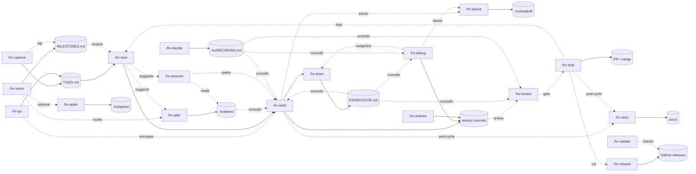

<div align="center">

# hv-skills

**A workflow for Claude Code that plans before coding, makes one commit per task, and keeps a project knowledge layer that survives `/clear`.**

[](https://github.com/l4ci/hv-skills/releases)
[](LICENSE)
[](https://github.com/l4ci/hv-skills/commits)
[](https://github.com/l4ci/hv-skills/stargazers)
[](https://claude.com/claude-code)

[Quickstarts](#quickstarts) · [FAQ](#faq) · [Skills](#skills) · [How it works](#how-it-works) · [Docs](docs/)

</div>

---

## Why hv-skills?

- **Planning has its own commands.** `/hv-vision` for milestones, `/hv-plan` for slice-level plans you can sign off on, `/hv-spike` for feasibility experiments on a throwaway branch, `/hv-assume` for a peek at the orchestrator's approach before any code is written.
- **Atomic per-task commits.** Each commit lands one task with one verify step, so reverts stay surgical. Workers run in parallel under a single orchestrator.
- **Knowledge stays around.** `/hv-learn` writes gotchas and conventions into `KNOWLEDGE.md`, grouped by topic. Future runs of `/hv-work`, `/hv-debug`, and `/hv-review` read it back automatically, so you stop re-discovering the same problem three sessions in a row.
- **Local-first.** Everything lives in `.hv/` under your project. No daemon, no MCP server, no cloud, no database. Just bash, Python, git, and optionally `gh`.
- **Survives `/clear`.** `/hv-pause` writes a handoff note with your current hypothesis, next step, and mid-edit files. `/hv-next` reads it back in a fresh session.

## Features

|  |  |
|---|---|
| 📥 **Auto-classified capture** — bugs, features, tasks routed with priority/size tags and zero-padded IDs (`[B01]`, `[F01]`, `[T01]`) | ⚡ **Parallel execution** — orchestrator plans, workers implement in parallel, one atomic commit per task |
| 🌿 **Branch or worktree isolation** — main stays clean while agents work, run multiple sessions side by side | 🧠 **Knowledge retention** — `/hv-learn` writes durable learnings; `/hv-work`, `/hv-debug`, and `/hv-review` all consult them |
| ♻️ **Backlog reconciliation** — `/hv-next` validates `status.json` against git state, auto-cleans stale entries | 🐛 **Systematic debugging** — `/hv-debug` reproduces, hypothesizes, verifies, fixes, nudges `/hv-learn` |
| 🚢 **Review-gated shipping** — `/hv-ship` runs `/hv-review` against original intent + conventions before PR or merge | 💾 **Context-clear recovery** — `/hv-next` re-reads active streams with recent commits and any handoff note, routing you back to work |
| 🔧 **Refactor cycles** — `/hv-refactor` explores friction, designs competing approaches, fixes in parallel | 🤝 **Graceful handoff** — `/hv-pause` writes what's in your head (hypothesis, next step, mid-edit files) so `/hv-next` picks up after a `/clear` |
| 🧭 **Vision & milestones** — `/hv-vision` brainstorms milestones using web research and a critique pass; `/hv-next` and `/hv-pause` keep work scoped to the active set | 🔗 **Loose milestone tags** — items can carry a `Milestone:` field; multi-active milestones run in parallel when their dependencies allow |
| 📋 **Plan-as-artifact** — `/hv-plan` writes implementation plans to `.hv/plans/<key>.md`; `/hv-work` consults the plan if present instead of decomposing ad-hoc | 🧪 **Throwaway spikes** — `/hv-spike` runs feasibility experiments on a dedicated `spike/<name>` branch; the branch never merges, only findings come back to main |
| 🔍 **Approach peek** — `/hv-assume` prints the orchestrator's intended files, tests, and assumptions before `/hv-work` runs, so corrections happen before code lands | 🧰 **Local-first, gitignored** — `.hv/` lives with your code; commit it intentionally to share state, or keep it private (the default) |
| 🤖 **Autonomy levels** — `autonomy.level: "off"` (default nudges), `"auto"` (chain `/hv-work` → `/hv-learn`, `/hv-debug` → `/hv-ship`), or `"loop"` (drain the backlog) — quality gates still apply | ⚙️ **Interactive config** — `/hv-config` shows current values, lets you check off which keys to change, and reuses `/hv-init`'s option vocabulary so you never hand-edit JSON |
| 🌐 **Umbrella mode** — one coordinator across N independent sub-repos: shared `KNOWLEDGE.md` / `DECISIONS.md` / `MILESTONES.md` / `TODO.md` at the umbrella; commits, branches, PRs land in each sub-repo's own `.git/`. No submodules. Tag items with `Repos:` to route work | 🔀 **Per-repo fan-out** — `/hv-refactor` and `/hv-work` route to the resolved sub-repo; `/hv-pause` keys handoffs by `(branch, repo)` so two sub-repos sharing a branch name don't clobber each other |

## Quickstarts

Install once, then pick the path that matches where you're starting from.

```bash
claude plugin marketplace add l4ci/hv-skills
claude plugin install hv-skills
```

`/hv-init` always comes first. It takes about 30 seconds, asks five questions (models, isolation, merge strategy, quality gates, autonomy level) with sensible defaults preselected, and creates `.hv/` with the data files (`TODO.md`, `KNOWLEDGE.md`, `MILESTONES.md`), per-type subdirectories, the `hv-*` CLI helpers, and managed blocks in `CLAUDE.md`. To change settings later, run `/hv-config` rather than hand-editing JSON.

### Path A — Drop into an existing project

You already have code. You want somewhere to put the bug list and feature ideas piling up in your head, a way to execute them without churn, and a record of what you learned along the way.

```bash
# 1. one-time setup — 5 questions, ≤30s, creates .hv/
/hv-init

# 2. brain-dump what's on your plate; the model classifies and assigns IDs
/hv-capture "timer resets on tab refocus, dropdown overlaps on mobile, want a keyboard shortcut to toggle"
# → [B01] timer reset on tab refocus     (Bug, P1, Major)
# → [B02] mobile dropdown overlap        (Bug, P2, Cosmetic)
# → [F01] toggle keyboard shortcut       (Feature, Minor)

# 3. review the backlog; reconciles status.json against git, suggests next
/hv-next
# → suggests [B01] (P1 first); on confirm runs /hv-work [B01]
#   orchestrator plans tasks → workers implement in parallel → atomic commit per task

# 4. hot-path fix that shouldn't go through the queue
/hv-go "rename SettingsPanel → PreferencesPanel and update imports"
# → captures [T02] and implements in one pass — no /hv-next round-trip

# 5. when /hv-work hits a real bug, run a debug cycle
/hv-debug B02
# → reproduce → hypothesize → verify hypothesis → fix → nudge /hv-learn

# 6. ship — runs /hv-review (PASS / CONCERNS / FAIL) then GitHub PR or direct merge
/hv-ship

# 7. distill what was non-obvious into KNOWLEDGE.md (auto-consulted next time)
/hv-learn
# → "Hidden-tab pauses use document.visibilityState; setInterval is throttled"
#   filed under "Performance & Rendering"
```

Need to step away mid-cycle? `/hv-pause` writes a handoff note (hypothesis, next step, mid-edit files) so a fresh session running `/hv-next` picks up where you left off. See [docs/getting-started.md](docs/getting-started.md) for the fuller walkthrough.

### Path B — Start from (nearly) nothing

You have an empty repo or a few sketches. You want to think through where this is going before you start shipping, and have that vision stay visible while you work.

```bash
# 1. one-time setup
/hv-init

# 2. brainstorm vision and milestones — Socratic discovery + web research + deliberate challenge
/hv-vision
# → MILESTONES.md: M01 active, M02 (depends: M01), M03 (depends: M01)
# → .hv/milestones/M01.md: goal, acceptance, rationale, risks, research notes
# → CLAUDE.md vision-index updated so /hv-next scopes picks to M01

# 3. (optional) de-risk an unknown before committing — branch never merges
/hv-spike sse-over-nginx
# → spike/sse-over-nginx branch + .hv/spikes/sse-over-nginx.md (question, findings, decision)

# 4. write the implementation plan for the first slice — /hv-work will consult it
/hv-plan M01-S01
# → .hv/plans/M01-S01.md: tasks with verifiable outcomes, named assumptions, open questions

# 5. seed milestone-tagged items into the backlog
/hv-capture "OAuth callback handler, secure token storage, refresh-token flow"
# → [F02][F03][F04] all tagged Milestone: M01

# 6. (optional) peek the orchestrator's intended approach before code lands
/hv-assume F02
# → reads M01-S01 plan, prints intended files / tests / assumptions / unknowns; nothing executes

# 7. active milestone scopes picks; /hv-work consults the plan
/hv-next
# → suggests [F02]; runs /hv-work against M01-S01.md

# 8. ship M01-S01; PR body links resolved IDs and the milestone
/hv-ship

# 9. capture what surfaced
/hv-learn
# → "PKCE callback timing varies in dev — gate on window.location.origin"
#   filed under "Auth & Identity"
```

When the milestone ships, mark it `shipped` (which unblocks its dependents), then either run `/hv-vision` again to add more milestones or jump straight to the next active one. See [docs/usage/vision-and-plans.md](docs/usage/vision-and-plans.md) for the deeper walkthrough.

## FAQ

**Why hv-skills over GSD?**

GSD models projects as formal phases: discuss, plan, execute, verify, audit. Each phase gets its own agent and `.planning/` sign-off artifacts. That's the right shape for regulated work, hard requirements, or anywhere a defensible verification trail matters more than speed. hv-skills runs differently: a tight `capture → next → work → ship → learn` loop with markdown artifacts you can edit by hand, and no phase ceremony unless you ask for it. Plan-as-artifact exists (`/hv-plan` writes one file per slice or item), but it's optional rather than the spine of the workflow. If you need sign-off rigor, GSD fits better. If you want a faster loop with knowledge that carries across sessions, that's what hv-skills is built for.

**Why hv-skills over Octo?**

Octo orchestrates multiple AI providers (Claude, Gemini, Codex) for debates, consensus, 100-point PRD scoring across providers, and a Discover/Define/Develop/Deliver pipeline. If cross-model validation is where your value comes from, Octo is purpose-built for it. hv-skills is deliberately single-provider. Instead of cross-AI debate, it leans hard into Claude Code: `AskUserQuestion`, subagent dispatch, branch and worktree isolation, atomic commits, and handoff notes that survive `/clear`. Use Octo when you want multiple models second-guessing each other. Use hv-skills when you've decided on Claude Code and want the workflow built around it.

**Why hv-skills over a TODO.md and good intentions?**

Most workflows start that way and most stay there. Three things tend to drift, and hv-skills addresses each of them. (1) Commits stop being atomic — one PR ends up touching six unrelated things. (2) Knowledge stops accumulating — you re-discover the same gotcha three sessions in a row because nothing reads it back. (3) Sessions don't survive `/clear` — you lose the live hypothesis the moment you step away. `/hv-work` enforces atomic per-task commits, `/hv-learn` writes durable gotchas that future runs auto-consult, and `/hv-pause` / `/hv-next` carry intent across context resets. If none of those bite you in practice, stock Claude Code is genuinely fine. If they do, that's the gap hv-skills is filling.

## Skills

| Skill | Description |
|-------|-------------|
| `/hv-init` | Initialize `.hv/` with `TODO.md`, `KNOWLEDGE.md`, `MILESTONES.md`, `counters.json`, `config.json`, `status.json`, and helpers |
| `/hv-config` | Edit `.hv/config.json` interactively — checklist of current values, then native option pickers for each chosen key |
| `/hv-vision` | Brainstorm a project's bigger vision and milestones using Socratic discovery, web research, and a critique pass; writes `MILESTONES.md` plus per-milestone detail files |
| `/hv-capture` | Capture bugs, features, and tasks — auto-classifies, assigns priority/size, routes to the correct section |
| `/hv-c` | Shortcut for `/hv-capture` |
| `/hv-go` | Capture an item and immediately implement it — combines `/hv-capture` + `/hv-work` in one pass |
| `/hv-next` | Review backlog, reconcile active work against git state, suggest the next item, route to `/hv-work` |
| `/hv-pause` | Gracefully stop mid-session — writes a handoff note (next step, hypothesis, mid-edit files) for the next session's `/hv-next` |
| `/hv-plan` | Write an implementation plan for a milestone slice or item (`M01-S01`, `M01-B07`) — task decomposition with verifiable outcomes, named assumptions, open questions; `/hv-work` consults if present |
| `/hv-spike` | Throwaway feasibility experiment on a `spike/<name>` branch — branch never merges, only findings come back as `.hv/spikes/<name>.md` |
| `/hv-assume` | Read-only peek of the orchestrator's intended approach — files, tests, assumptions, unknowns; gates `/hv-work` for high-stakes work |
| `/hv-work` | Orchestrated parallel implementation with per-task commits; consults `KNOWLEDGE.md` and `.hv/plans/<key>.md` if present |
| `/hv-debug` | Systematic bug cycle — reproduce, hypothesize, verify, fix with one atomic commit, nudge `/hv-learn` |
| `/hv-decide` | Capture a hard-boundary decision into `.hv/DECISIONS.md` — manually confirmed, never auto-invoked; decisions differ from learnings by being active commitments with explicit forbids/permits |
| `/hv-docs` | Scaffold and maintain a public-facing user guide under `docs/` — discovery, scaffold, post-cycle proposals, and restructure modes |
| `/hv-review` | Staff-engineer review of a branch vs original intent + `KNOWLEDGE.md`; returns PASS / CONCERNS / FAIL |
| `/hv-ship` | Bundle commits into a PR (or direct merge) with ID-linked body; runs `/hv-review` first by default |
| `/hv-learn` | Extract durable session learnings into `KNOWLEDGE.md`, grouped by topic; Opus verification on by default |
| `/hv-refactor` | Full architectural refactor cycle with parallel design + implementation subagents |
| `/hv-release` | Cut a release: bump version, generate notes, tag, push, publish to GitHub/GitLab. |
| `/hv-update` | Check for a newer hv-skills release on GitHub and print the exact update command for your install type |

## How it works


```mermaid
flowchart LR
  VISION["/hv-vision"] --> MILES[(MILESTONES.md)]
  VISION -.optional.-> SPIKE["/hv-spike"]
  VISION -.routes.-> PLAN["/hv-plan"]
  CAP["/hv-capture"] --> TODO[(TODO.md)]
  CAP -.tag.-> MILES
  GO["/hv-go"] --> TODO
  GO -.one-pass.-> WORK
  TODO --> NEXT["/hv-next"]
  MILES -.scopes.-> NEXT
  NEXT -.suggests.-> ASSUME["/hv-assume"]
  NEXT -.suggests.-> PLAN
  NEXT --> WORK["/hv-work"]
  PLAN --> PLANS[(.hv/plans/)]
  PLANS -.consults.-> WORK
  ASSUME -.reads.-> PLANS
  ASSUME -.peeks.-> WORK
  SPIKE --> SPIKES[(.hv/spikes/)]
  WORK -.pause.-> PAUSE["/hv-pause"]
  DEBUG -.pause.-> PAUSE
  PAUSE --> HANDOFF[(.hv/handoff/)]
  WORK --> COMMIT[(atomic commits)]
  DEBUG["/hv-debug"] --> COMMIT
  REFACTOR["/hv-refactor"] --> COMMIT
  COMMIT -.review.-> REVIEW["/hv-review"]
  REVIEW -.gate.-> SHIP["/hv-ship"]
  SHIP --> PR[(PR / merge)]
  WORK --> LEARN["/hv-learn"]
  DEBUG -.nudge/auto.-> LEARN
  SHIP -.loop.-> NEXT
  LEARN --> KNOW[(KNOWLEDGE.md)]
  KNOW -.consults.-> WORK
  KNOW -.consults.-> DEBUG
  KNOW -.consults.-> REVIEW
  DECIDE["/hv-decide"] --> DECISIONS[(.hv/DECISIONS.md)]
  DECISIONS -.consults.-> WORK
  DECISIONS -.consults.-> DEBUG
  DECISIONS -.consults.-> REVIEW
  WORK -.post-cycle.-> DOCS["/hv-docs"]
  SHIP -.post-cycle.-> DOCS
  DOCS --> USERDOCS[(docs/)]
  SHIP -.cut.-> RELEASE["/hv-release"]
  RELEASE --> RELEASES[(GitHub releases)]
  UPDATE["/hv-update"] -.checks.-> RELEASES
```

Everything Claude reads or mutates lives under `.hv/` in your project. Git is the source of truth; `status.json` is just a cache, and `/hv-next` reconciles any drift between the two.

## Configuration

Edit `.hv/config.json`:

```json
{
  "models":   { "orchestrator": "opus",   "worker": "sonnet" },
  "work":     { "isolation": "branch",    "mergeStrategy": "direct" },
  "debug":    { "competingHypotheses": false },
  "refactor": { "confirmBeforeExecute": true },
  "learn":    { "verify": true },
  "ship":     { "review": true },
  "docs":     { "path": "docs",           "autoCreate": false },
  "umbrella": { "enabled": false },
  "autonomy": { "level": "off" }
}
```

The defaults are conservative: branch isolation, direct merge, review gate on, knowledge verifier on, docs auto-write off (pending an LLM safety review), no autonomous chaining. Set `autonomy.level` to `"auto"` to chain `/hv-work` → `/hv-learn` and `/hv-debug` → `/hv-ship` automatically, or `"loop"` to keep going until the backlog drains. `umbrella.enabled` is set automatically by `/hv-init` when it detects two or more git children at the parent; see [docs/usage/umbrella-mode.md](docs/usage/umbrella-mode.md). For every key and when to flip it, see [docs/usage/configuration.md](docs/usage/configuration.md).

### Drift detection

Every `bin/hv-preflight` (run by most hv-skills) compares the project's recorded `hvSkills.version` against the currently-installed plugin. On drift it prints one informational line nudging `/hv-init` so the project picks up new helpers. Under `autonomy.level: "auto"` or `"loop"`, `/hv-update` also offers (or auto-dispatches) `/hv-init` after a plugin upgrade so the drift clears in one step.

## Architecture

```
.hv/
├── TODO.md           # bugs, features, tasks, recent completions
├── KNOWLEDGE.md      # durable learnings, grouped by topic
├── DECISIONS.md      # hard-boundary decisions with explicit forbids/permits
├── MILESTONES.md     # vision paragraph + milestone overview
├── ARCHIVE.md        # completions older than 5 days
├── counters.json     # auto-incrementing IDs
├── config.json       # models, isolation, merge, verify, umbrella
├── status.json       # active work streams (keyed by branch, or (branch, repo) in umbrella mode)
├── repos.json        # umbrella mode only — registered sub-repos
├── bugs/ features/ tasks/   # overflow detail files
├── milestones/       # one detail file per milestone (M01.md, M02.md, ...)
├── plans/            # /hv-plan output (M01-S01.md slice plans, M01-B07.md item plans)
├── spikes/           # /hv-spike findings — one file per spike, branch lives in git
├── handoff/          # /hv-pause notes; one per branch (or per (branch, repo) under umbrella)
└── bin/              # CLI helpers — see docs/reference/cli-helpers.md
```

Helpers collapse multi-step agent logic into single subprocess calls. That keeps the per-invocation context smaller and the output format consistent. In umbrella mode the same `.hv/` lives at the umbrella root and coordinates work across sub-repos; see [docs/usage/umbrella-mode.md](docs/usage/umbrella-mode.md).

## Install alternatives

### skills CLI

```bash
npx skills add l4ci/hv-skills
```

### npx one-liner

```bash
npx @anthropic-ai/claude-code plugin marketplace add l4ci/hv-skills
npx @anthropic-ai/claude-code plugin install hv-skills
```

### Local development (GNU Stow)

```bash
git clone https://github.com/l4ci/hv-skills.git ~/Code/hv-skills
stow --dir="$HOME/Code" --target="$HOME/.agents/skills" hv-skills
# remove: stow --dir="$HOME/Code" --target="$HOME/.agents/skills" -D hv-skills
```

## Testing

Smoke-test the CLI helpers against a throwaway `.hv/` in a tmpdir:

```bash
bash test/smoke.sh
```

Exercises all `hv-*` helpers across 234 assertions. Exits non-zero on any failure.

## Contributing

Issues and PRs welcome. Keep changes minimal, include a smoke-test assertion if you touch or add a helper, and follow the commit style in `git log`.

## License

[MIT](LICENSE)
