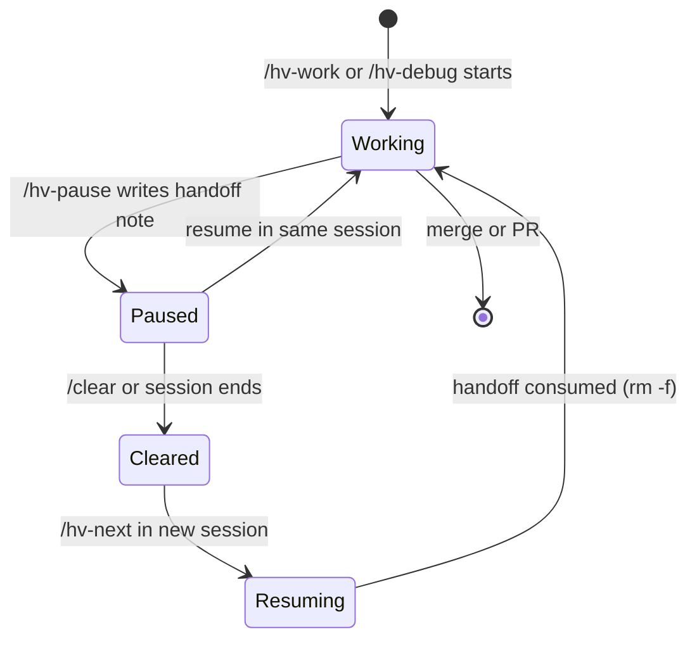

# Pausing and resuming

Long sessions hit `/clear` or get interrupted. `/hv-pause` writes what was in your head before you leave, and [`/hv-next`](picking-work.md) picks it back up when you return.

## /hv-pause

`/hv-pause` captures the live state of a mid-session investigation into `.hv/handoff/<branch>.md` before you stop. Git commits carry code. The handoff note carries intent: current hypothesis, next planned step, files that are mid-edit, and gotchas you ran into along the way.

**Use it when:**

- Your context window is filling and a `/clear` is coming.
- You're stepping away mid-[`/hv-work`](running-work.md) or mid-debug without a clean stopping point.
- A long investigation needs to survive a session boundary.

**What happens:** the skill resolves the active branch, asks how you want to handle uncommitted work (wip commit, stash, or leave dirty), then writes the handoff note. One note per branch; re-pausing overwrites the previous one.

The note's shape:

```
## Working on
## What's done
## Next planned step
## Current hypothesis
## Files mid-edit
## Uncommitted work
## Gotchas discovered
## Do not
```

You don't need to manage this file directly. `/hv-next` reads and deletes it on resolve.



## /hv-next reads handoff notes

When active streams exist, `/hv-next` reads any handoff note matching each stream and surfaces the **Stage**, **Next planned step**, and **Current hypothesis** inline. Path resolution mirrors `/hv-pause`'s write side: `.hv/handoff/<branch>@<repo>.md` for umbrella streams, with a fallback to `.hv/handoff/<branch>.md` for single-repo cycles or pre-umbrella handoffs.

If a handoff is present, `/hv-next`'s per-stream question offers "Resume with `/hv-work`" as the recommended action. The handoff brief flows into the dispatched `/hv-work`, and the note is `rm -f`-ed once the user confirms the resume. "Leave handoff for later" preserves the file so the next `/hv-next` invocation surfaces it again.

## Recovering after /clear

A typical recovery looks like this:

1. You're mid-investigation on branch `hv/my-feature`, context is filling. You run `/hv-pause`, which writes `.hv/handoff/hv-my-feature.md` with your current hypothesis and the next step you were about to try.
2. You run `/clear`. All conversation context is gone.
3. In the new session, you run `/hv-next`.
4. The skill reads `status.json`, validates active streams against git, finds the handoff note for `hv/my-feature`, and surfaces something like:

```
Active streams
  hv/my-feature  (3 commits)  mid-implementation

Handoff note found:
  Next planned step: add the retry path in src/worker.ts
  Current hypothesis: the timeout is in the fetch wrapper, not the caller

→ Resuming /hv-work with handoff brief
```

5. You confirm, and `/hv-work` picks up with the handoff note as its brief. The note is deleted.

## When to /hv-pause vs just commit and walk away

A clean commit is enough when the work sits at a natural stopping point: a passing test, a completed subtask, a checkpoint that git state alone can describe. `/hv-pause` is for the messy middle. The live hypothesis, the half-written test, the "I was about to try X": none of that survives a `/clear` from git state alone. If you'd have to re-read diffs and reconstruct your reasoning to figure out what to do next, pause first.

## Orchestrator handoff

A parallel-round orchestrator runs for hours, and its context fills. Two hooks make it hand off before that happens, with no one at the keyboard. They act only on the orchestrator, the session that holds the [round lease](parallel-rounds.md) (`hv round start`). Workers also run Claude, never hold the lease, and are not touched.

**Install it** once per project:

```
hv hook install                      # .claude/settings.local.json, per developer, not committed
hv hook install --wrap-statusline    # when you already have a statusLine
```

`install` merges into the settings file and never replaces anything it did not write. It adds a `Stop` hook (`hv hook stop`), a `SessionStart` hook (`hv hook session-start`) and a statusline (`hv statusline dump`). Hook entries end in `# hv-hook`, so a second run updates them instead of stacking copies. `--scope project` writes `.claude/settings.json` (committed), `--scope user` your Claude config dir.

**Your own statusline keeps working.** With a statusline already set, plain `install` refuses (exit 4). `--wrap-statusline` rewrites it to `hv statusline dump --then '<your command>'` and keeps the original beside it as `hvWrapped`. The dump records the session state, then runs your command with the same input and output, so your bar looks the same. `hv hook uninstall` removes the hooks and puts your command back. The file is rewritten as two-space JSON; if it already is, the round trip is byte for byte.

**What happens at the threshold.** Every statusline refresh writes the session's state (context percentage, rate limits) under the git common dir, `hv/session/<session_id>.json`. When the orchestrator tries to stop and the state shows `orchestrator.handoffThreshold` percent (default 75) or more, the Stop hook blocks and tells it to write `.hv/handoff/<base>.md` and run `/exit`. If it was told twice and still wrote nothing, the hook gives up and records `handoffFailed` in the state, so a session that cannot write a handoff is not held forever. The percentage comes from `context_window.used_percentage`, else from `current_usage` over `context_window_size`.

**The next session.** The SessionStart hook fires on `startup` and `clear`. When the new session holds the lease and the handoff exists, it injects the file as context and moves it to `<base>.md.consumed`. A restarted orchestrator has not run `hv round start` yet, so it holds no lease: a fresh handoff written by the Stop hook (first line `<!-- hv-handoff: orchestrator -->`) is injected anyway. Its first act is `hv round start`, then it reads the handoff. `resume` and `compact` keep the file.

`hv doctor` reports whether the statusline runs the dump and the hooks are in place (`statusline`, `stop-hook`). Restarting the pane after the exit is not part of this: that is D2 (#66), and usage limits are D3 (#67). Without the hooks, `/hv-pause` and `/hv-next` are the manual route.
