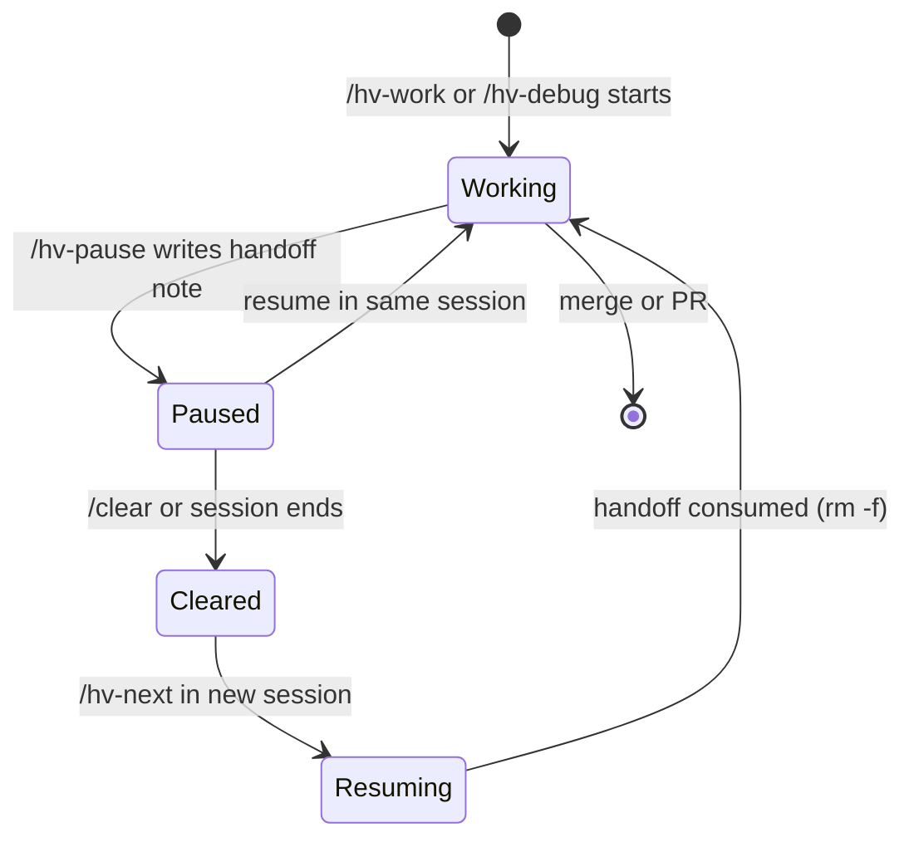

# Pausing and resuming

Long sessions hit `/clear` or get interrupted. `/hv-pause` writes what was in your head before you leave, and [`/hv-next`](picking-work.md) picks it back up when you return.

## /hv-pause

`/hv-pause` captures the live state of a mid-session investigation into `.hv/handoff/<branch>.md` before you stop. Git commits carry code. The handoff note carries intent: current hypothesis, next planned step, files that are mid-edit, and gotchas you ran into along the way.

**Use it when:**

- Your context window is filling and a `/clear` is coming.
- You're stepping away mid-[`/hv-work`](running-work.md) or mid-debug without a clean stopping point.
- A long investigation needs to survive a session boundary.

**What happens:** the skill resolves the active branch, asks how you want to handle uncommitted work (wip commit, stash, or leave dirty), then writes the handoff note. One note per branch; re-pausing overwrites the previous one.

The note's shape:

```
## Working on
## What's done
## Next planned step
## Current hypothesis
## Files mid-edit
## Uncommitted work
## Gotchas discovered
## Do not
```

You don't need to manage this file directly. `/hv-next` reads and deletes it on resolve.



## /hv-next reads handoff notes

When active streams exist, `/hv-next` reads any handoff note matching each stream and surfaces the **Stage**, **Next planned step**, and **Current hypothesis** inline. Path resolution mirrors `/hv-pause`'s write side: `.hv/handoff/<branch>@<repo>.md` for umbrella streams, with a fallback to `.hv/handoff/<branch>.md` for single-repo cycles or pre-umbrella handoffs.

If a handoff is present, `/hv-next`'s per-stream question offers "Resume with `/hv-work`" as the recommended action. The handoff brief flows into the dispatched `/hv-work`, and the note is `rm -f`-ed once the user confirms the resume. "Leave handoff for later" preserves the file so the next `/hv-next` invocation surfaces it again.

## Recovering after /clear

A typical recovery looks like this:

1. You're mid-investigation on branch `hv/my-feature`, context is filling. You run `/hv-pause`, which writes `.hv/handoff/hv-my-feature.md` with your current hypothesis and the next step you were about to try.
2. You run `/clear`. All conversation context is gone.
3. In the new session, you run `/hv-next`.
4. The skill reads `status.json`, validates active streams against git, finds the handoff note for `hv/my-feature`, and surfaces something like:

```
Active streams
  hv/my-feature  (3 commits)  mid-implementation

Handoff note found:
  Next planned step: add the retry path in src/worker.ts
  Current hypothesis: the timeout is in the fetch wrapper, not the caller

→ Resuming /hv-work with handoff brief
```

5. You confirm, and `/hv-work` picks up with the handoff note as its brief. The note is deleted.

## When to /hv-pause vs just commit and walk away

A clean commit is enough when the work sits at a natural stopping point: a passing test, a completed subtask, a checkpoint that git state alone can describe. `/hv-pause` is for the messy middle. The live hypothesis, the half-written test, the "I was about to try X": none of that survives a `/clear` from git state alone. If you'd have to re-read diffs and reconstruct your reasoning to figure out what to do next, pause first.

## Orchestrator handoff

A parallel-round orchestrator runs for hours, and its context fills. Two hooks make it hand off before that happens, with no one at the keyboard. They act only on the orchestrator, the session that holds the [round lease](parallel-rounds.md) (`hv round start`). Workers also run Claude, never hold the lease, and are not touched.

**Install it** once per project:

```
hv hook install                      # .claude/settings.local.json, per developer, not committed
hv hook install --wrap-statusline    # when you already have a statusLine
```

`install` merges into the settings file and never replaces anything it did not write. It adds a `Stop` hook (`hv hook stop`), a `SessionStart` hook (`hv hook session-start`) and a statusline (`hv statusline dump`). Hook entries end in `# hv-hook`, so a second run updates them instead of stacking copies. `--scope project` writes `.claude/settings.json` (committed), `--scope user` your Claude config dir.

**Your own statusline keeps working.** With a statusline already set, plain `install` refuses (exit 4). `--wrap-statusline` rewrites it to `hv statusline dump --then '<your command>'` and keeps the original beside it as `hvWrapped`. The dump records the session state, then runs your command with the same input and output, so your bar looks the same. `hv hook uninstall` removes the hooks and puts your command back. The file is rewritten as two-space JSON; if it already is, the round trip is byte for byte.

**What happens at the threshold.** Every statusline refresh writes the session's state (context percentage, rate limits) under the git common dir, `hv/session/<session_id>.json`. When the orchestrator tries to stop and the state shows `orchestrator.handoffThreshold` percent (default 75) or more, the Stop hook blocks and tells it to write `.hv/handoff/<base>.md` and run `/exit`. If it was told twice and still wrote nothing, the hook gives up and records `handoffFailed` in the state, so a session that cannot write a handoff is not held forever. The percentage comes from `context_window.used_percentage`, else from `current_usage` over `context_window_size`.

**The next session.** The SessionStart hook fires on `startup` and `clear`. When the new session holds the lease and the handoff exists, it injects the file as context and moves it to `<base>.md.consumed`. A restarted orchestrator has not run `hv round start` yet, so it holds no lease: a fresh handoff written by the Stop hook (first line `<!-- hv-handoff: orchestrator -->`) is injected anyway. Its first act is `hv round start`, then it reads the handoff. `resume` and `compact` keep the file.

`hv doctor` reports whether the statusline runs the dump and the hooks are in place (`statusline`, `stop-hook`). The hooks are opt-in: until `hv hook install` has written something, both checks skip. After that they fail on a partial or broken install (one hook missing, a statusline without the dump, a hook command that no longer resolves). Restarting the orchestrator after the exit is the next section; usage limits are D3 (#67). Without the hooks, `/hv-pause` and `/hv-next` are the manual route.

## Keepalive

The hooks end an orchestrator session cleanly. `hv keepalive run` starts the next one. Start the orchestrator under it, in the pane it will own:

```
hv keepalive run -- claude --model opus       # everything after -- is the command
```

`hv keepalive run` is the pane's foreground process and `claude` is its child, so it learns the exit from the child's own status and needs neither herdr nor tmux to notice it. This is a supervisor, not a watcher: the issue (#66) asks for a watcher on herdr's process PID or `agent_status_changed`, and D2 runs the orchestrator as a child instead. The cost is that an orchestrator not started under `run` is not restarted.

**When it restarts.** On every exit it looks for a fresh handoff, `.hv/handoff/<base>.md` no older than `orchestrator.handoffMaxAgeSeconds`. With one, it waits `orchestrator.keepaliveBackoffSeconds` (5) and starts the command again with the restart prompt, `orchestrator.restartPrompt`, appended as the last argument. The first start never gets the prompt. Without one, it stops: that is how `/exit` from you ends the loop.

**The lease.** `run` takes the [round lease](parallel-rounds.md) and holds it across restarts, and tells its child through `HV_ROUND_HOLDER_PID`. So `hv round start` and the hooks inside the orchestrator see the supervisor as the holder: the round number survives a restart, and the SessionStart hook injects the handoff at once, without `hv round start` first. A second `run`, or an orchestrator started by hand, is refused while it lives (`hv round start` exits 4). `hv keepalive status` shows the supervisor and the lease; a supervisor killed with SIGKILL leaves a stale lease, which the next `run` reclaims.

**The breaker.** A restarted orchestrator that dies before it reads the handoff (bad auth, a hook error) leaves the same file behind. `run` counts a restart as progress only when the handoff changed, a new write with different content. After `orchestrator.keepaliveBreaker` (3) restarts in a row without progress it stops, and after `orchestrator.keepaliveMaxRestarts` (10) restarts in total it stops regardless. Both stops post an escalation comment on issue `orchestrator.escalateIssue` through `hv round escalate send`, and raise the herdr notification. With `escalateIssue` unset, which is the default, you get the notification and a warning only. The handoff is kept; fix the cause and run it again.

**How it stops.** The supervisor stops when the orchestrator leaves no fresh handoff (`no-handoff`), on the breaker or the restart limit (exit 1), or when you interrupt it: SIGINT and SIGTERM go to the child, the supervisor waits for it and does not restart (`interrupted`). It then releases the lease and records `status: stopped` in `<git-common-dir>/hv/keepalive.json`. It never deletes the handoff; only the SessionStart hook consumes it.

The flags `--max-restarts`, `--breaker`, `--backoff` and `--prompt` override the config for one run. `--no-limits` leaves out the usage-limit watcher the supervisor otherwise runs beside the command (see [usage limits](#usage-limits)). `--json` prints one envelope when the loop ends, not before.

## Usage limits

A 5-hour or weekly usage limit stops a session until the window resets. `hv limit watch` keeps a round from stalling on that: it notices the limit, waits for the reset, and types a resume prompt into the pane. Under `hv keepalive run` the same loop runs inside the supervisor, so there is nothing more to start. For an orchestrator not started under `run`, start the verb in the background or in a pane of its own:

```
hv limit watch            # blocks for the life of the round
hv limit status           # the log, and whether anything is watching
```

`watch` needs the round lease, because moving work between accounts is the orchestrator's act. It refuses to start (exit 4) without it, under a live `hv keepalive run` (which already watches) or beside another watcher.

**How it notices.** For the orchestrator it reads the rate limits the statusline dump stores: a window at 100 percent with its reset still ahead is a limit, and the later reset wins if both are. For a worker slot it reads the account meter (`hv worker account list`), but only after the slot's pane shows a limit message, never on a timer. The message itself is the fallback: on herdr 0.9.x the loop subscribes to `pane.output_matched` with the phrases `hv worker poll` already uses for LIMITED, on tmux (or if herdr refuses the subscription) it captures the panes every `--settle` seconds. A message with no data behind it gets its reset time from the text (`resets at 3pm` reads as the next 3pm in your time zone, within 8 days), and otherwise sleeps `limits.fallbackSleepSeconds`. "Approaching your usage limit" is a warning and starts nothing.

**Sleep or switch.** `limits.mode` is `switch` (default) or `sleep`.

- `sleep` waits for the reset.
- `switch` applies to a worker slot only. It uses the rule `hv round assign` uses: keep the slot's account unless it is cooling, otherwise take the account with the most headroom (`hv worker account pick --exclude <account>`). With such an account and an idle slot on it, the slot's issue moves there with `hv round transfer`, so the work continues from its pushed branch and a handoff comment. With no usable account, or no idle slot on it, the limit sleeps instead, and the entry says why.
- **The orchestrator only sleeps.** A limited session cannot write a handoff, and a restarted one with no handoff has nothing to continue from. Handing off before the limit and switching the orchestrator's account are follow-up work: #206.

**Resuming.** At the reset plus `limits.resumeMarginSeconds` (60) the loop types `limits.resumePrompt` into the pane and keeps watching it. A pane still limited after the prompt starts another cycle, up to `limits.maxResumes` (3) for one limit. Past that the entry is `failed` and the loop posts an escalation on issue `orchestrator.escalateIssue`, or raises a host notification when that is unset. Stop the watcher with Ctrl-C or SIGTERM and the waiting entries stay waiting: the next watcher resumes any whose reset has already passed.

**Where the log is.** The `limits` list in `.hv/workers.json`, beside `slots` and `escalations`. Each entry (`l1`, `l2`, ...) records the session (`orchestrator` or a slot), the window, whether the reset came from data or text, when it resets, the action, its status (`waiting`, `resumed`, `switched` or `failed`) and a note. `hv limit status` reads it back, and `hv round status` and `hv round reconcile` list the ones still waiting. Nothing prunes resolved entries.

**Config.** Five keys under `limits`, all silent defaults: `mode` (`switch`), `resumeMarginSeconds` (60), `fallbackSleepSeconds` (1800), `maxResumes` (3) and `resumePrompt` (`The usage limit has reset. Continue where you left off.`). See [configuration](configuration.md#limits-keys).
