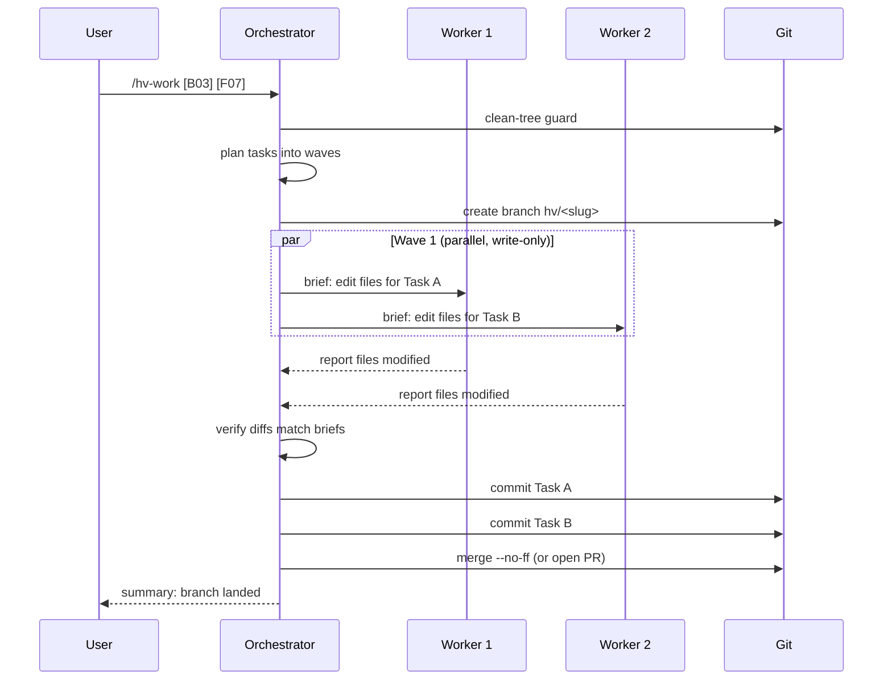

# Implementing

Items captured in [`BACKLOG.md`](../reference/hv-folder.md) reach "merged" through `/hv-work`, an orchestrator that plans, dispatches parallel workers, and lands one atomic commit per task. For a single ad-hoc fix, `/hv-go` collapses capture and implementation into one pass.

## /hv-work

`/hv-work` is the main implementation driver. The orchestrator plans tasks, dispatches workers in parallel (one per task), verifies each result, then either merges to main or opens a PR based on your `work.mergeStrategy`.

**Trigger phrases:**

- `/hv-work` after `/hv-next` routes you here automatically
- `/hv-work [B03]` to implement a specific item by ID
- `/hv-work [B03] [F07]` to implement a batch of items together
- `/hv-work "add retry logic to the upload pipeline"` describes the work; it captures and executes

**Precondition:** refuses to start on a dirty working tree. Commit or stash first.

**Status tracking:** registers in `.hv/status.json` at start so [`/hv-next`](picking-work.md) in another session knows those items are in progress.



## One commit per task

Each task lands as its own atomic commit. One item, one commit, tagged with the item ID:

```
a1b2c3d fix: retry logic on network timeout [B03]
d4e5f6a feat: per-project theme support [F07]
g7h8i9j task: update CI to Node 20 [T02]
```

That keeps reverts surgical (drop one task without touching others), makes PR review easier (read commit by commit), and leaves a predictable history `/hv-ship` reads to build PR bodies automatically.

## Isolation: branch vs. worktree

Set `work.isolation` in [`config.json`](configuration.md):

| Mode | How it works | When to use |
|------|-------------|-------------|
| `"branch"` (default) | Feature branch in the current worktree | Solo work, simple workflows |
| `"worktree"` | Isolated directory under `.claude/worktrees/` | Parallel sessions, keep main clean while agents work |

With `"branch"`, your main worktree switches to the feature branch for the duration of the run. With `"worktree"`, the main worktree stays on `main`, so you can keep editing there while agents work in isolation.

To run multiple `/hv-work` sessions at the same time on different item batches, pick `"worktree"`. See [parallel-work](parallel-work.md) for the multi-session pattern.

## /hv-go: capture and run in one pass

Use `/hv-go` when you have a specific fix in mind and want it done now, not queued.

```
/hv-go "fix the off-by-one in RingBuffer"
/hv-go "add a Cmd+K shortcut to the project picker"
```

The item still gets a real ID in `BACKLOG.md` (counters increment, history is preserved), but the `/hv-next` review round-trip is skipped. `/hv-go` hands off to `/hv-work` after capture completes.

`/hv-go` caps clarifying questions on purpose. It assumes the requirement is clear enough to act on. If you're still exploring or the scope is fuzzy, [`/hv-capture`](capturing-work.md) first is safer.

**Flow:** clean-tree guard, capture via `/hv-capture`, work via `/hv-work`.

`/hv-go` inherits all `/hv-capture` rules (classification, detail-file overflow, ID assignment) and all `/hv-work` rules (branch/worktree isolation, parallel workers, per-task commits).

## Capture vs. Go vs. Work: picking the right entry

Three skills trigger on action-shaped phrases. Pick by **intent**, not by the verb typed:

| The user wants to… | Use | Why |
|---------------------|-----|-----|
| Brain-dump items into the backlog without acting now | `/hv-capture` | Records only; no execution, no clean-tree guard |
| Get one specific thing done right now (not yet captured) | `/hv-go` | Captures → immediately runs `/hv-work`, with a low question cap |
| Implement an item that's already in `BACKLOG.md` | `/hv-work` | Plans, dispatches workers, verifies, commits per task |
| Pick the next thing from the backlog and execute | `/hv-next` | Reconciles → suggests → routes to `/hv-work` |

**Rules of thumb:**

- *"fix X"* / *"add Y"* / *"do Z"*: clear single thing, not yet captured → `/hv-go`.
- A list of things, no immediate action, *"capture this"* / *"add to backlog"* → `/hv-capture`.
- Reference to an existing `[B##]`/`[F##]`/`[T##]` plus *"implement"* / *"build"* / *"do this one"* → `/hv-work`.
- *"what's next?"* / *"pick something"* / *"what should I work on?"* → `/hv-next`.

When intent is ambiguous, the cheapest path is `/hv-capture`. Items can be picked up later by `/hv-next` or `/hv-work`, but a hot-path `/hv-go` cycle is hard to reverse if you actually wanted a backlog entry.

See [capturing work](capturing-work.md) for capture details and [picking work](picking-work.md) for how `/hv-next` selects and prioritizes.

## Merge or PR

After `/hv-work` finishes, `work.mergeStrategy` in `config.json` controls what happens next:

| Strategy | Behavior |
|----------|----------|
| `"direct"` (default) | Merges the branch to main with `--no-ff`, deletes the branch |
| `"pr"` | Pushes the branch and creates a GitHub PR with a summary |

The actual ship-time gates (review, preflight, PR body composition) live in [review and ship](review-and-ship.md).
