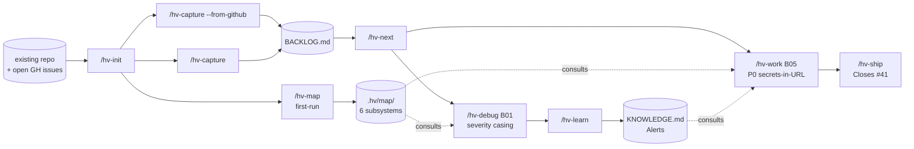

# Brownfield — dropping hv-skills into an existing project

You have a codebase. You've been maintaining it for months or years. You're tracking a list of bugs informally, some open GitHub issues you haven't gotten to, and a vague sense that the same gotchas keep recurring. By the end of this walkthrough hv-skills is wired into the project, your bugs are captured, one is shipped, and a first lesson is in `KNOWLEDGE.md`.

The example project is **Pinpoint**, an internal incident dashboard. Node and React, deployed as a single container. It's been in production for 18 months. 14 open GitHub issues, 30-odd `TODO` comments scattered through the source, and three bugs you keep meaning to fix.

## The shape of the walkthrough



Ten steps follow, in execution order.

## Step 1 — /hv-init

```bash
$ /hv-init
```

Same five questions as a greenfield setup. For an existing repo I usually flip two from the defaults: `worktree` isolation so `main` stays untouched while agents run (useful when you also need to deploy from `main` mid-cycle), and `pr` merge strategy if your team requires GitHub review. For a solo maintenance pass, the defaults are fine.

`/hv-init` writes `.hv/` and the managed blocks in `CLAUDE.md`. It doesn't read your code. That happens next.

## Step 2 — /hv-map first-run

`/hv-work` and `/hv-debug` need to know what subsystems your project has so they don't burn context re-exploring the same directories on every cycle. `/hv-map` first-run is a one-shot scaffold.

```bash
$ /hv-map
```

It asks: *first-run scaffold, after-work update, or consolidate?* Pick first-run. It walks the repo, identifies entry points (servers, CLIs, tests, build scripts), and proposes a subsystem breakdown. For Pinpoint:

```
Proposed subsystems:
  - api          server/api/* (Express routes, request validation)
  - dashboard    web/src/dashboard/* (React dashboard pages)
  - alerts       server/alerts/* (rule engine, dedup, escalation)
  - integrations server/integrations/{datadog,pagerduty,slack}/*
  - storage      server/storage/* (Postgres pool, migrations)
  - shared       shared/* (cross-cutting types, utils)

Write 6 subsystem files to .hv/map/? [y/N]
```

You confirm. Each file gets a one-paragraph *Purpose*, an *Entry points* section pointing at `file:line` waypoints, and a `summary:` frontmatter field that gets pulled into the always-on `## Project Map` block in `CLAUDE.md`.

The map isn't exhaustive. Just enough for the orchestrator to know where to look. After every `/hv-work` cycle, touched subsystems get their `last-touched` date bumped automatically (`after-work` mode runs as a post-cycle step). Over time you'll run `/hv-map consolidate` when subsystems drift or duplicate.

## Step 3 — /hv-capture --from-github (optional)

If your project has open GitHub or GitLab issues, sync them into `BACKLOG.md` rather than retyping them by hand. Use `--from-github` for GitHub repos, `--from-gitlab` for GitLab.

```bash
$ /hv-capture --from-github
```

`hv-issues-provider` detects whether your origin points at GitHub or GitLab. `hv-issues-list` fetches open issues from the right provider. `hv-issues-imported` checks what's already been pulled, so re-running the skill never double-imports. What's left shows up as a multiSelect picker:

```
Open issues on yourorg/pinpoint:
  [ ] #14  alert dedup fires twice on rapid escalation
  [ ] #21  dashboard date filter ignores timezone
  [ ] #28  Datadog integration drops events when rate-limited
  [ ] #33  PagerDuty incident link uses old API endpoint
  [ ] #41  integration config UI accepts secrets in URL query string
  ...
```

You pick the five you care about. The rest stay open upstream, untouched. Each picked issue gets a fresh `B##` or `F##` ID, a `GH: #N` cross-reference in its BACKLOG entry, and a detail file at `.hv/{bugs,features}/<ID>.md` linking the upstream URL. Optionally, with explicit consent, an `in-progress` label is applied upstream so collaborators see the issue is claimed.

```
[B01] alert dedup fires twice on rapid escalation     Bug, P1, Major, GH: #14
[B02] dashboard date filter ignores timezone          Bug, P1, Major, GH: #21
[B03] Datadog drops events under rate-limit           Bug, P1, Major, GH: #28
[B04] PagerDuty incident link uses old API endpoint   Bug, P2, Minor, GH: #33
[B05] integration config UI accepts secrets in URL    Bug, P0, Major, GH: #41
```

`/hv-capture` flagged B05 as P0 because it tagged "secrets in URL" as a security category. P0 always jumps the queue in `/hv-next`.

Round-trip closing is automatic when `/hv-ship` runs: the PR body gets `Closes #N` lines (GitHub auto-closes on merge), or the direct-push path offers a manual-gated `hv-issues-close` prompt for each resolved upstream issue.

If your project has no remote tracker, skip this step entirely.

## Step 4 — /hv-capture for the mental backlog

The remaining items, the ones you've been tracking informally, go in via `/hv-capture`. Brain-dump in one go; the model splits, classifies, and assigns IDs.

```bash
$ /hv-capture "alert rule editor crashes on empty title; we should add a /health endpoint for k8s; dedup window is hardcoded at 5 min, should be per-rule; DST off-by-one on dashboard 24h filter"
```

Output:

```
[B06] alert rule editor crash on empty title  Bug, P1, Major
[F01] /health endpoint for k8s probes         Feature, Minor
[F02] per-rule dedup window                   Feature, Major
[B07] DST off-by-one on dashboard 24h filter  Bug, P1, Major
```

The detail files at `.hv/bugs/B06.md` etc. capture the long-form description for items that overflow the one-line BACKLOG row.

F02 is size-Major. `/hv-capture` nudges you:

> *F02 is Major and touches multiple subsystems. Consider /hv-brainstorm F02 before /hv-plan — for design negotiation, not implementation.*

You take the nudge. `/hv-brainstorm F02` runs a focused design session: Socratic discovery, two competing approaches with tradeoffs, sectioned design with per-section approval. The output lands at `.hv/designs/F02.md`. When `/hv-plan F02` runs later, it reads that file as soft input rather than re-deriving the design.

## Step 5 — /hv-next surveys everything

```bash
$ /hv-next
```

It reconciles `status.json` against git (nothing active yet, clean state), archives completions older than five days (none yet), and shows you the full sorted picture:

```
In Progress: (none)

Bugs (sorted P0 → P2):
  [B05] integration config UI accepts secrets in URL   P0 Major  GH: #41
  [B01] alert dedup fires twice on rapid escalation    P1 Major  GH: #14
  [B02] dashboard date filter ignores timezone         P1 Major  GH: #21
  [B03] Datadog drops events under rate-limit          P1 Major  GH: #28
  [B06] alert rule editor crash on empty title        P1 Major
  [B07] DST off-by-one on dashboard 24h filter         P1 Major
  [B04] PagerDuty incident link uses old API           P2 Minor  GH: #33

Features (sorted Major → Cosmetic):
  [F02] per-rule dedup window                          Major     design: .hv/designs/F02.md
  [F01] /health endpoint for k8s probes                Minor

Suggested next: [B05] (P0 first)
Run /hv-work B05? [y/N]
```

P0 always wins. You confirm.

## Step 6 — a hot-path fix that skips the queue: /hv-go

Before you commit to B05, you spot a typo in the contributing guide while scanning another file. Too small to queue.

```bash
$ /hv-go "fix typo in CONTRIBUTING.md line 23, 'depencency' → 'dependency'"
```

`/hv-go` mints `[T01]`, dispatches a worker, lands one commit on a feature branch, merges back. About thirty seconds. Same machinery as `/hv-work`; it collapses capture and execute into one pass for things too small to queue.

## Step 7 — the P0 cycle

Back to B05. The integration config UI accepts secrets in a URL query string field instead of routing them through a password input. They end up in browser history and access logs.

```bash
$ /hv-work B05
```

The orchestrator reads B05's detail file, queries `KNOWLEDGE.md` for the `Security` topic (empty so far), reads `.hv/map/integrations.md` for entry points, and decomposes:

```
Task 1. Render integration-config secrets via <input type="password">.
        Verify: snapshot test on the form asserts type="password" on every field marked secret.
Task 2. Server-side validation rejects secrets in URL query for the integration POST endpoint.
        Verify: integration test posts a URL-form-encoded secret, asserts 400 with the right error.
Task 3. Migration to scrub existing access logs for known secret patterns.
        Verify: dry-run against a fixture log, redacted-line count matches expected.
Task 4. Update integration docs to describe the new form.
        Verify: docs build passes.
```

Four tasks, four commits, all on `hv/B05-secrets-in-url-form`. Worktree isolation keeps `main` clean. The branch merges back via `--no-ff`, so the cycle is one revertable unit if anything goes sideways downstream.

## Step 8 — a real debug cycle

Two days later you tackle B01, the dedup-fires-twice issue. You run `/hv-work B01`. The orchestrator dispatches, the worker writes what looks like a fix, and the verify step fails:

```
[worker] verify: test/alerts/dedup_test.js (FAIL — 2 events still delivered)
[worker] verify failed — stopping. Recommend /hv-debug B01.
```

You take the nudge.

```bash
$ /hv-debug B01
```

The cycle:

1. **Reproduce.** Run the failing test, confirm two events. Add console logs at the dedup gate.
2. **Hypothesize.** `dedupKey` is built from `rule_id + entity_id + severity`. The logs show the second event arrives with severity `"high"`, while the first was `"HIGH"`. The two integrations send different casing.
3. **Verify the hypothesis.** Add an assertion: `dedupKey` should match across the two events when severity is lowercased. The assertion passes. Hypothesis confirmed.
4. **Fix.** Lowercase `severity` in the dedup-key computation. One-line change. Re-run the failing test; it passes. Run the full alerts suite; green.
5. **Commit.** `fix(alerts): normalize severity casing in dedup key [B01]`.
6. **Nudge /hv-learn.**

Run it.

```bash
$ /hv-learn
```

The bullet that lands:

```markdown
## Alerts

- **Severity is case-sensitive in the dedup key path.** External integrations send inconsistent casing for severity (Datadog sends `high`, PagerDuty sends `HIGH`). Normalize at the boundary, not at storage time. The dedup gate runs before normalization. Fix once at the integration layer, or accept that the bug-class returns.
```

This bullet now travels with every future `/hv-work` and `/hv-debug` cycle in the `alerts` or `integrations` subsystems. Next time you or a teammate touches dedup logic, the orchestrator pulls this paragraph into its planning context automatically. The class of bug doesn't recur.

## Step 9 — /hv-ship

When the branch is ready:

```bash
$ /hv-ship
```

`/hv-review` reads commits, resolved IDs, and any `KNOWLEDGE.md` topics matching touched files. For the B01 fix it returns `PASS`. `/hv-ship` builds a PR body from the commit subjects and the `GH: #14` cross-reference on B01, opens the PR via `gh`, and prints the URL. On merge, GitHub auto-closes #14 because the body includes `Closes #14`. `BACKLOG.md` moves B01 to `## Completed` and stamps it with the merge commit SHA.

If you'd configured `work.mergeStrategy = direct` instead, `/hv-ship` would have merged into `main` directly and prompted the optional `hv-issues-close` step to close #14 upstream with a tracking comment naming the commit.

## Step 10 — over the next week

After a week of dropping hv-skills into Pinpoint:

- `BACKLOG.md` has 11 items from the combined import and brain-dump; six are shipped, two in flight, the rest queued
- `KNOWLEDGE.md` has four to six bullets across `Alerts`, `Storage`, `Integrations`, and `Security`. Surprises worth keeping, not a fix log
- `.hv/MAP.md` has six subsystems, three of them `last-touched: 2026-05-19` (this week) and three older
- `DECISIONS.md` has one hard boundary you committed to mid-cycle: *"Secrets are never accepted via URL query params on any integration endpoint. Forbids: query-string POST bodies. Permits: form bodies with `type=password` inputs."* Future workers must respect it; the orchestrator surfaces it during planning if a touched file is in scope.
- One milestone if you decided to add one, e.g. `M01 — security hardening`. Or none, if you've been working straight off the backlog. Either is fine; brownfield doesn't require a milestone to be useful.

What you notice over time is that the same class of gotcha stops recurring. Three months from now, when a teammate ships a new integration and trips the severity-casing bug, the next `/hv-work` cycle pulls the `## Alerts` knowledge bullet into context and the orchestrator flags it during planning, before any code lands.

## What changes structurally

You don't have to refactor anything to adopt hv-skills. The only structural addition is `.hv/` (gitignored by default) and a managed block in `CLAUDE.md`. Your existing build, tests, deploy pipeline, and code layout stay the same. The map and the knowledge accumulate from how you already work (debug, fix, ship), except now the loop leaves a trace that future cycles consult automatically.
