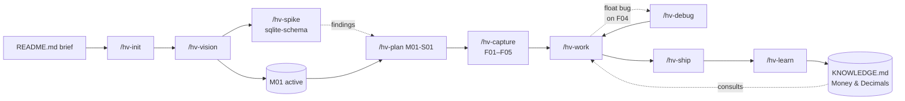

# Greenfield — from a brief to a shipped milestone

You have an idea, a one-page brief, and an empty repo. By the end of this walkthrough you have a roadmap on disk, a slice plan, real code in `main`, and durable knowledge captured for the next session.

The project carried through every step is **Tally**, a self-hosted household budget tracker. CLI first, web dashboard later. The brief lives at the project root as `README.md`:

```markdown
# Tally

A self-hosted budget tracker for a household. CLI-first so I can pipe transactions in from bank exports. Eventually a small web dashboard so my partner can use it without learning the CLI. Single binary preferred. Privacy is the point — no cloud sync.

Must-haves: capture transactions (date, amount, category, note), monthly category rollups, year-over-year compare. Nice-to-have: budget vs actual alerts.

Constraints: I want to dogfood this within two weeks. Postgres or SQLite, no decision yet. Go or Rust, leaning Go.
```

The repo has the README, a `.gitignore`, and nothing else.

## The shape of the walkthrough



Ten steps follow, in execution order.

## Step 1 — /hv-init

```bash
$ /hv-init
```

Five questions, about thirty seconds. For a solo greenfield I take the defaults: orchestrator `opus` and worker `sonnet`, branch isolation, direct merge, review gate on, autonomy off. Flip any of these later via `/hv-config`.

The command writes:

- `.hv/BACKLOG.md`, `KNOWLEDGE.md`, `DECISIONS.md`, `MILESTONES.md`, `CONTEXT.md`
- `.hv/counters.json`, `config.json`, `status.json`
- `.hv/bin/` (every CLI helper)
- Managed blocks in `CLAUDE.md` so the orchestrator picks up project knowledge, decisions, context, and the active milestone

`.hv/` is gitignored by default. To commit project state later (so the backlog and learnings travel with the repo), drop the `.hv/` line from `.gitignore`.

## Step 2 — /hv-vision

`/hv-vision` turns "I have an idea" into "I have milestones I can execute against." It runs Socratic discovery, then web research, then a critique pass.

```bash
$ /hv-vision
```

It reads `README.md` and any stack file (`package.json`, `go.mod`, `Cargo.toml`, …) at the project root before asking anything. If your brief lives under a different name (`briefing.md`, `pitch.md`, `idea.md`), point at it in the opening message — *"there's a brief at brief.md"* — and the skill picks it up.

The first discovery question is usually short and pointed:

> *Your brief says "dogfood within two weeks." What does dogfooded mean concretely — (a) you have a working CLI you use daily for two weeks before showing anyone else, or (b) the CLI plus a shared deployment with your partner within those two weeks?*

You answer. It probes one more layer ("would month one of CLI-only be enough validation, or does the web piece have to land for the dogfood to count?") and then moves to web research.

Web research surfaces things you might not have considered. For Tally:

- The popular self-hosted budget tools are web-first (Firefly III, Actual). A CLI-first design is unusual but defensible.
- `shopspring/decimal` for Go and `rust_decimal` for Rust are both well maintained. Float math for money is the canonical mistake.
- OFX and QIF imports remain common from US banks. Pure CSV is more universal but loses metadata.

The critique pass pushes back on your scope:

> *Your brief calls Postgres-or-SQLite "no decision yet," but the rest of your constraints (single binary, privacy, household scale) strongly favor SQLite. Want me to lock that in as M01 scope, or keep it open?*

You commit to SQLite. After two or three rounds of back and forth you end up with:

```markdown
# Milestones

Privacy-first household budget tracker. CLI as the daily driver, web dashboard for non-technical users. Single binary, SQLite storage. Dogfood gate: maintainer uses it daily for two weeks before adding the dashboard.

## Active milestones

- **M01** — CLI MVP (depends: —)
  CSV import, transaction capture, monthly rollups, YoY compare.

- **M02** — Web dashboard (depends: M01)
  Read-mostly browser UI sharing the same SQLite file. Partner-usable.

- **M03** — Budget alerts (depends: M01)
  Threshold-based notifications. CLI flag plus optional system notification.
```

Plus three detail files at `.hv/milestones/M01.md`, `M02.md`, `M03.md`, each with goal, acceptance criteria, rationale, risks, and the research findings from the session.

`/hv-vision` marks M01 active and seeds the always-on `## Project Vision` block in `CLAUDE.md`. Every subsequent skill knows what the active milestone is.

## Step 3 — /hv-spike (optional)

The vision session named one unknown: the SQLite schema design for transactions, specifically how you'd handle multi-currency. The brief doesn't require it, but you suspect you'll add it within a year. A spike checks whether a one-currency-now schema would hurt later.

```bash
$ /hv-spike sqlite-schema "Will a single-currency schema survive multi-currency migration cleanly?"
```

This creates a `spike/sqlite-schema` branch (which never merges into `main`) and `.hv/spikes/sqlite-schema.md` with the question recorded. You experiment on the branch: try two schemas, write a sketch migration, see what feels right. When you're done, fill in *Findings* and *Decision* in the spike file:

```markdown
**Findings.** A `currency` column added later with default `'USD'` and a backfill works fine; the rollup queries need a one-line change. No data loss.

**Decision.** Ship single-currency in M01. Add `currency` column in M03 or later, no need to engineer it in advance.
```

Then run `.hv/bin/hv-spike-finish sqlite-schema` to stamp it done. The branch stays in git as reference; only the findings come back to `main`.

For a brand-new project you might do zero spikes. Use them when the answer materially changes the design.

## Step 4 — /hv-plan M01-S01

`/hv-vision` set the destination. `/hv-plan` sets the route for the first slice.

```bash
$ /hv-plan M01-S01
```

A focused session walks you through goal, approach, task decomposition, named assumptions, and open questions. The output lives at `.hv/plans/M01-S01.md`:

```markdown
---
key: M01-S01
milestone: M01
unit: S01
title: Storage foundation and transaction capture
status: draft
created: 2026-05-13
---

## Goal

Stand up the SQLite schema and the `tally add` command end-to-end so the rest of M01 builds on a working data layer.

## Approach

Single binary, `cobra` for the CLI, `database/sql` plus `mattn/go-sqlite3`. Decimal math via `shopspring/decimal`. Migrations as embedded SQL files via `embed`. Each command opens the DB lazily.

## Tasks

1. **Skeleton CLI** — `cmd/tally/main.go`, `cmd/tally/root.go`. `tally --version` prints, `tally help` lists commands. Verify: `go test ./... && tally --version | grep v0.0.0`.
2. **Migrations engine** — `internal/store/migrate.go` plus `migrations/001_init.sql`. `tally init` creates the DB at `$XDG_DATA_HOME/tally/tally.db` and runs migrations idempotently. Verify: run twice; second run is a no-op.
3. **Transactions table** — schema covers `id`, `date`, `amount_minor`, `category`, `note`. Amounts stored as int64 minor units (cents). Verify: insert/select round-trips `decimal.NewFromString("12.34")` cleanly.
4. **`tally add` command** — flags `--date`, `--amount`, `--category`, `--note`. Validates decimal precision (max 2 places). Verify: `tally add --amount 12.345 --category food` exits non-zero with a clear error; `tally add --amount 12.34 --category food` exits 0 and the row appears in `tally list`.
5. **`tally list` command** — basic select with date range filter (`--since`, `--until`). Verify: ordering deterministic by `date ASC, id ASC`.

## Assumptions

- Solo use for M01; concurrent writes are not a concern.
- XDG paths on Linux only; Windows/macOS deferred to M02.
- `cobra` chosen for ecosystem familiarity; would re-evaluate at M03 if alerts need a different flag system.

## Open questions

- None blocking. Multi-currency deferred per the sqlite-schema spike.
```

`/hv-work` consults this plan when it dispatches. The verify step on each task is what keeps workers honest; a task with no verify step is not well-defined.

## Step 5 — /hv-capture

The plan named five tasks. You can either run `/hv-work` against the plan directly (it decomposes the same way), or capture the slice as backlog items first so each gets an ID, a detail file, and a KNOWLEDGE.md link. For greenfield I prefer the capture step: it gives me hooks for tracking, and `/hv-next` surfaces items in order.

```bash
$ /hv-capture "tally CLI skeleton, sqlite migrations engine, transactions schema with int64 minor units, tally add command, tally list command"
```

The output:

```
[F01] tally CLI skeleton                          Feature, Minor, Milestone: M01
[F02] sqlite migrations engine                    Feature, Minor, Milestone: M01
[F03] transactions schema with int64 minor units  Feature, Minor, Milestone: M01
[F04] tally add command                           Feature, Minor, Milestone: M01
[F05] tally list command                          Feature, Minor, Milestone: M01
```

Each gets a row in `BACKLOG.md` under `## Features`, tagged `Milestone: M01`. Detail files live at `.hv/features/F01.md` … `F05.md` (auto-created when the description is long enough to overflow the BACKLOG row).

If any of these had been size-Major instead of Minor, `/hv-capture` would have nudged you toward `/hv-brainstorm` before plan to negotiate the design first. Minor items skip that layer.

## Step 6 — first cycle: /hv-next → /hv-work → /hv-ship → /hv-learn

```bash
$ /hv-next
```

```
Backlog (M01 active):
  Features: F01, F02, F03, F04, F05 (all Minor)

Suggested next: F01 (head of M01 dependency chain)
Run /hv-work F01? [y/N]
```

You confirm. The orchestrator reads `.hv/plans/M01-S01.md`, picks the F01 task, and dispatches a worker on `hv/F01-tally-cli-skeleton` (branch isolation):

```
[orchestrator] Plan reads: 1. Skeleton CLI ...
[orchestrator] Dispatching 1 worker on branch hv/F01-tally-cli-skeleton
[worker]  ↳ created cmd/tally/main.go, cmd/tally/root.go, go.mod
[worker]  ↳ verify: go test ./...                      (PASS)
[worker]  ↳ verify: tally --version | grep v0.0.0      (PASS)
[worker]  ↳ commit: feat(cli): scaffold tally root command [F01]
```

`hv-complete` marks F01 done in `BACKLOG.md`. `/hv-work` merges the branch into `main` with `--no-ff` (direct merge), deletes the branch, and prompts for the next item.

You repeat for F02 and F03. F03 introduces something subtle. The transactions schema stores amounts as int64 minor units, but the worker writes a helper that converts `decimal.Decimal` to int64 by multiplying by 100 and casting. Looks right. Isn't.

## Step 7 — a real bug, run /hv-debug

F04 lands. You try a quick smoke test:

```bash
$ tally add --amount 12.34 --category food --note "lunch"
$ tally add --amount 0.10 --category food
$ tally list
2026-05-13  12.34   food  lunch
2026-05-13   0.09   food
```

`0.10` came back as `0.09`. Classic float intermediary. Time for a debug cycle.

```bash
$ /hv-debug
```

It asks which open or recently completed item to debug. You point at F04 (the `add` command, though the real bug was introduced in F03's helper). The cycle:

1. **Reproduce.** Write a failing test against the conversion helper. `TestAmountRoundTrip` fails: `0.10` → `9`, expected `10`.
2. **Hypothesize.** The orchestrator inspects the helper and proposes: *the implementation uses `amount.Float64() * 100` and casts to int64; `0.10` has no exact float64 representation, so the multiplication produces `9.9999…` which truncates to `9`.*
3. **Verify the hypothesis before changing code.** Add a debug print of the intermediate float. It prints `9.999999999999998`. Confirmed.
4. **Fix.** Replace the float roundtrip with `decimal`'s own shift. Parse input via `decimal.NewFromString(input)`, then `shifted.Shift(2).IntPart()`. The test now passes for `0.10`, `12.34`, `0.001` (correctly errors), and `99999.99`.
5. **Commit.** `fix(money): use decimal.Shift instead of Float64 for minor-unit conversion`. One atomic commit.
6. **Nudge /hv-learn.** `/hv-debug` ends with: *this was a subtle gotcha (decimal/float interaction). Run /hv-learn to capture it?*

You do, after Step 8.

## Step 8 — /hv-ship

When F05 lands the slice is functionally complete:

```bash
$ /hv-ship
```

`/hv-ship` runs `/hv-review` first. The reviewer reads recent commits, the resolved item IDs, and any `KNOWLEDGE.md` topics that match touched files. It returns one of `PASS`, `CONCERNS`, `FAIL`.

For M01-S01 you get `PASS` with one `CONCERNS` note attached: *"F05 uses `fmt.Println` for output; consider `cmd.OutOrStdout()` for testability when the web dashboard imports the same package in M02."* You file that as a follow-up via `/hv-capture` and continue.

`/hv-ship` then either opens a GitHub PR or merges directly into `main`, depending on `work.mergeStrategy`. Solo mode for Tally is direct merge.

## Step 9 — /hv-learn

The float-bug session produced one durable insight. `/hv-learn` writes it into `KNOWLEDGE.md` under a topic of your choice:

```bash
$ /hv-learn
```

The verifier judges every bullet for durability before it lands. It rejects "fixed the bug" but accepts:

```markdown
## Money & Decimals

- **Never multiply a `decimal.Decimal` by a float to convert to minor units.** `Float64() * 100` produces `9.999…` for inputs like `0.10`; truncation gives `9`. Use `decimal.NewFromString(...).Shift(2).IntPart()` end-to-end. The float path is silently wrong, not noisy.
```

The topic shows up in the `## Project Knowledge` block in `CLAUDE.md`. Next time `/hv-work` touches money handling, the orchestrator pulls this section via `hv-knowledge-query "Money & Decimals"` before planning, so the same trap doesn't bite a worker again.

## Step 10 — repeat, then close M01

You loop steps 6–9 through additional slices: `tally summary` for monthly rollups, `tally yoy` for year-over-year compare, a CSV importer. Each `/hv-plan M01-S02`, `M01-S03`, `M01-S04` writes its own slice plan; `/hv-capture` seeds items; `/hv-work` ships them; `/hv-learn` catches anything subtle that surfaced.

After the importer ships, `/hv-next` says:

```
M01 has no open items.
Run `.hv/bin/hv-vision-status M01 shipped` to close the milestone?
```

You run it. M02 and M03 (which both depend on M01) flip from blocked to ready in `MILESTONES.md`. The next `/hv-vision` invocation enters edit mode and refines M02's plan with what you learned in M01. The float gotcha now informs the dashboard's number rendering, and the XDG-paths-Linux-only assumption gets revisited for cross-platform packaging.

## What you have after two weeks

- `main` has one commit per task, each verifiable in isolation
- `.hv/MILESTONES.md` shows M01 shipped, M02 active
- `.hv/KNOWLEDGE.md` carries five to ten bullets across three or four topics; learnings, not a fix log
- `.hv/plans/` keeps the M01-S01 plan on disk (slice plans persist; item-specific plans are auto-cleaned on ship)
- `.hv/spikes/sqlite-schema.md` is a permanent record of why M01 stayed single-currency

The next session in a fresh `/clear` starts from `/hv-next`, which reads the active milestone, the open backlog, and the managed blocks in `CLAUDE.md`. Nothing important is in your head. It's on disk, and the orchestrator's planning context now starts with what you learned.
