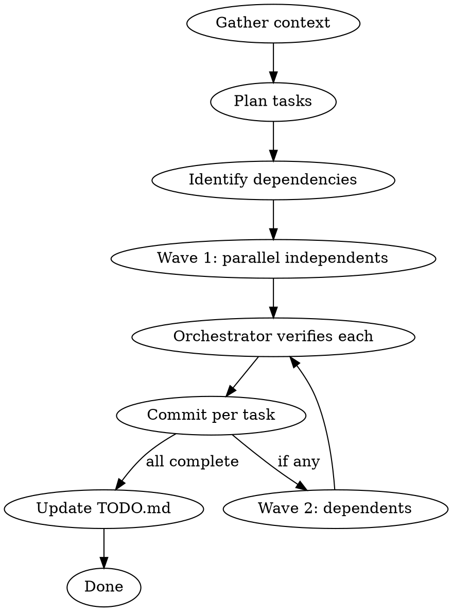

# hv:work

Opus-orchestrated parallel implementation with per-task verification and commits.

## Model Configuration

Before starting, read `.hv/config.json` if it exists. It contains:

```json
{
  "models": {
    "orchestrator": "opus",
    "worker": "sonnet"
  }
}
```

- Use `orchestrator` for the planning and verification model (Agent `model` parameter)
- Use `worker` for the implementation subagents (Agent `model` parameter)

If `.hv/config.json` doesn't exist, default to `opus` for orchestrator and `sonnet` for worker.

## When to Use

- User describes a task, feature, or list of improvements
- Conversation context contains enough spec to act on
- Work is decomposable into 2+ independent pieces

## Flow



## Step 1 — Mark Active & Gather Context

If `.hv/TODO.md` exists, mark the items you're about to work on as **active**. For each matching entry in `## Bugs`, `## Features`, or `## Todos`, insert an active marker right after the bold title:

```markdown
- **[P1] Timer badge shows stale duration.** *(active since 2025-04-15)* One to three sentences...
```

Format: insert ` *(active since YYYY-MM-DD)*` immediately after the `**...**` title, before the description text. Write `.hv/TODO.md` with these markers before starting any implementation. This flags in-progress work so a later `/hv:next` run can detect interrupted items.

Then, from the conversation context (user request, prior analysis, existing code):

1. Identify all discrete tasks to implement
2. For each task, determine: files to create/modify, what changes, acceptance criteria
3. Group into dependency waves:
   - **Wave 1:** All tasks that touch independent files (run in parallel)
   - **Wave 2+:** Tasks that depend on wave 1 outputs (sequential or next parallel batch)

Create a feature branch: `git checkout -b <descriptive-branch-name>`

## Step 2 — Dispatch Parallel Worker Agents

For each independent task, dispatch a subagent using the configured **worker** model with:

```
You are implementing Task N of [total].

**Goal:** [one sentence]

**Files:**
- Create: [paths]
- Modify: [paths with line references]

**What to do:**
[Precise instructions — what to read, what to change, exact code where possible]

**Critical constraints:**
[Behavior preservation rules, patterns to follow, things NOT to touch]

**Commit with message:**
[exact commit message to use]
```

**Rules for agent briefs:**
- Include enough context that the agent can work without asking questions
- Specify exact file paths and relevant line numbers
- Show the code pattern to follow (from existing codebase)
- Name the commit message — agents commit their own work
- Constraint: read files first, minimal diff, no unrelated changes

Launch all independent agents in a single message (parallel tool calls).

## Step 3 — Verify Each Completion

As each agent completes, the orchestrator verifies:

1. **Check the commit exists:** `git log --oneline -1`
2. **Read the modified files** — confirm changes match the brief
3. **Structural verification:** grep for expected patterns, count functions, check no regressions

Verdicts:
- **PASS** — commit is correct, move on
- **FAIL** — dispatch a fix agent with the specific issue, then re-verify

## Step 4 — Sequential Waves

If tasks have dependencies (shared files, one task's output feeds another):

1. Wait for wave 1 to complete and verify
2. Dispatch wave 2 agents with updated context (they can read wave 1's committed code)
3. Verify wave 2 the same way

## Step 5 — Update TODO.md

After all tasks pass verification, check if `.hv/TODO.md` exists. If it does:

1. Read `.hv/TODO.md`
2. For each completed task, find matching entries in `## Bugs`, `## Features`, or `## Todos` (they will have the `*(active since ...)* ` marker from Step 1)
3. Remove the active marker and move matched entries to `## Completed`, appending metadata:

```markdown
## Completed

- ~~**[B-1] [P1] Timer badge shows stale duration.**~~ Done 2025-04-15 [`a1b2c3d`]
- ~~**[F-3] [Minor] Quick-switch recent projects.**~~ Done 2025-04-15 [`f4e5d6c`]
- ~~**[T-1] Update Swift toolchain.**~~ Done 2025-04-15 [`d7e8f9a`]
```

Format: `- ~~**[ID] [tag] Title.**~~ Done YYYY-MM-DD [\`<short-hash>\`]`

Get the commit hash from `git log --oneline -1` (use the short hash of the merge commit or the last task commit).

**Matching rules:**
- Match by keyword overlap between the task description and TODO entry titles
- If unsure whether a TODO item was addressed, leave it in place — don't move items you didn't work on
- If the `## Completed` section doesn't exist, create it at the end of the file

## Step 6 — Merge to Main

After all tasks pass verification and TODO.md is updated:

```bash
git checkout main
git merge <branch> --no-ff -m "merge: <summary of all work>

- task 1 description
- task 2 description
..."
git branch -d <branch>
```

## Key Principles

- **Orchestrator plans and verifies, worker executes.** Models are configured in `.hv/config.json` (default: opus/sonnet). Never dispatch work without a clear brief. Never trust completion without reading the result.
- **One commit per task.** Each agent commits its own atomic change. This gives clean git history and easy revert granularity.
- **Parallel by default.** Independent tasks always run in parallel. Sequential only when there's a real file conflict or data dependency.
- **Agents commit themselves.** Include the commit message in the brief. The orchestrator doesn't batch-commit — each task is self-contained.
- **Branch isolation.** Work on a feature branch. Merge to main only after all verification passes.
- **Read before edit.** Every agent brief must instruct reading target files first.
- **Fail fast.** If an agent's work fails verification, fix it before moving to dependent tasks.
- **Track completions.** Always update TODO.md when items are resolved — keep the backlog honest.
